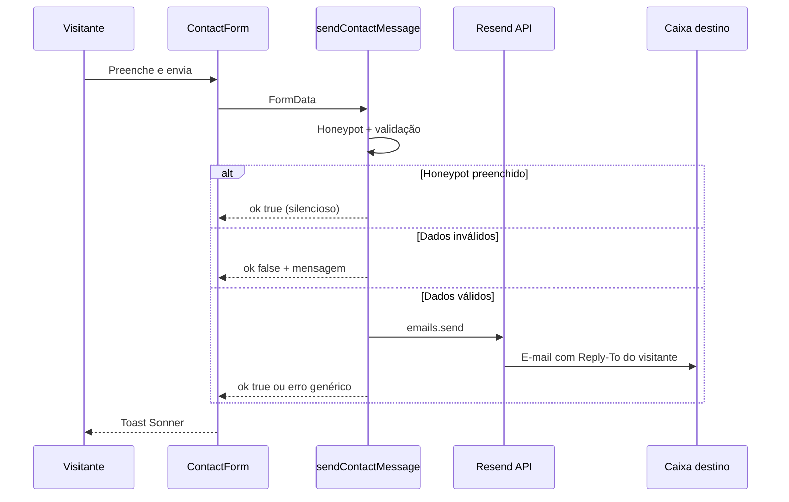

# Formulário de contato — envio de e-mail com Resend

> Documentação técnica e operacional da feature de contato do portal Observatório Brasileiro de Governo Digital (OBGD).
>
> **Rota pública:** [`/contato`](../src/app/(app)/contato/page.tsx)
>
> **Última atualização:** 2026-08-01

---

## 1. Visão geral

Visitantes enviam mensagens pelo formulário em `/contato`. O backend valida os dados em uma **Server Action** do Next.js e dispara o e-mail via **[Resend](https://resend.com)** para a caixa institucional configurada (produção: `mbc@mbc.org.br`).

Não há persistência em banco ou CMS: o canal de entrega é apenas o e-mail. O visitante pode responder diretamente porque o campo **Reply-To** é o endereço informado no formulário.

| Aspecto | Decisão |
| --- | --- |
| Provedor | Resend (API HTTP) |
| Integração | Server Action (`'use server'`) |
| Destino (produção) | `mbc@mbc.org.br` |
| Persistência | Nenhuma (somente e-mail) |
| Anti-spam MVP | Campo honeypot oculto |
| Validação | Manual no servidor (sem Zod) |

---

## 2. Arquitetura



### Fluxo resumido

1. O cliente monta `FormData` a partir do `<form>` e chama `sendContactMessage`.
2. A action ignora bots (honeypot), valida campos e limites.
3. Em sucesso, chama `resend.emails.send` com texto + HTML escapado.
4. O formulário limpa os campos (incluindo remount do Select de assunto) e exibe toast.

---

## 3. Arquivos envolvidos

| Arquivo | Papel |
| --- | --- |
| [`src/app/(app)/contato/page.tsx`](../src/app/(app)/contato/page.tsx) | Página `/contato` (layout + formulário) |
| [`src/components/content/contact-form.tsx`](../src/components/content/contact-form.tsx) | UI do formulário (client), toasts, honeypot, reset do Select |
| [`src/app/actions/contact.ts`](../src/app/actions/contact.ts) | Server Action: validação + envio Resend |
| [`src/lib/contact.ts`](../src/lib/contact.ts) | `SUBJECT_OPTIONS`, limites e type guard compartilhados |
| [`.env.example`](../.env.example) | Modelo das variáveis de ambiente |
| `.env` | Segredos locais (**não versionar**) |

Dependência npm: `resend`.

---

## 4. Campos do formulário

| Campo | `name` | Obrigatório | Observações |
| --- | --- | --- | --- |
| Nome completo | `name` | Sim | Máx. 120 caracteres |
| E-mail | `email` | Sim | Máx. 254; formato básico `x@y.z` |
| Assunto | `subject` | Sim | Deve ser um de `SUBJECT_OPTIONS` |
| Mensagem | `message` | Sim | Máx. 5000 caracteres |
| Honeypot | `company_url_hp` | — | Oculto; se preenchido, sucesso silencioso sem envio |

### Assuntos permitidos

Definidos em `src/lib/contact.ts`:

- Dúvida geral
- Indicadores e dados
- Imprensa
- Parcerias
- Outro assunto

Para incluir/remover opções, altere `SUBJECT_OPTIONS` (UI e validação do servidor usam a mesma lista).

### Assunto do e-mail enviado

```
[Contato OBGD] {assunto} — {nome}
```

O corpo inclui nome, e-mail, assunto e mensagem (versão texto e HTML). O HTML escapa caracteres especiais para mitigar XSS no cliente de e-mail.

---

## 5. Variáveis de ambiente

| Variável | Obrigatória | Descrição |
| --- | --- | --- |
| `RESEND_API_KEY` | Sim | API key do Resend (`re_…`) |
| `RESEND_FROM_EMAIL` | Sim | Remetente no formato `Nome <email@dominio>` |
| `CONTACT_TO_EMAIL` | Sim | Destinatário das mensagens |

Exemplo em `.env.example`:

```bash
RESEND_API_KEY=
RESEND_FROM_EMAIL=Observatorio <onboarding@resend.dev>
CONTACT_TO_EMAIL=mbc@mbc.org.br
```

### Comportamento se faltar configuração

A action registra erro no servidor (`Contact form misconfigured…`) e devolve ao usuário apenas:

> Não foi possível enviar a mensagem. Tente novamente mais tarde.

Detalhes internos (chave ausente, resposta da API) **não** são expostos no toast.

---

## 6. Configuração

### 6.1 Desenvolvimento local

1. Crie conta em [resend.com](https://resend.com) e gere uma API key.
2. Copie `.env.example` → `.env` (ou complete o `.env` existente).
3. Preencha:

```bash
RESEND_API_KEY=re_sua_chave_real
RESEND_FROM_EMAIL=Observatorio <onboarding@resend.dev>
CONTACT_TO_EMAIL=seu-email-da-conta-resend@exemplo.com
```

4. Reinicie `npm run dev` após alterar o `.env` (o Next recarrega env, mas um restart evita estado antigo).
5. Abra `http://localhost:3000/contato`, envie uma mensagem e confira a caixa de destino (e spam).

**Limitação do modo teste:** com `onboarding@resend.dev`, o Resend só entrega para o **e-mail da conta Resend**. Não use `mbc@mbc.org.br` como `CONTACT_TO_EMAIL` até haver domínio verificado — o envio falha ou não chega ao destinatário institucional.

### 6.2 Produção

1. No Resend, verifique o domínio de envio (ex.: `mbc.org.br` ou domínio do Observatório).
2. Configure DNS (SPF, DKIM; DMARC recomendado) conforme o painel Resend.
3. Defina no ambiente de deploy:

```bash
RESEND_API_KEY=re_...
RESEND_FROM_EMAIL=Observatório <noreply@seu-dominio-verificado>
CONTACT_TO_EMAIL=mbc@mbc.org.br
```

4. Confirme que o host (Insper hoje; AWS depois) permite saída HTTPS para a API do Resend.
5. Faça um envio real pela página `/contato` e valide Reply-To respondendo ao e-mail recebido.

### 6.3 Segurança das chaves

- Nunca commitar `.env` ou expor `RESEND_API_KEY` em issues, chats ou capturas de tela.
- Se a key vazar, **revogue e gere outra** no dashboard Resend.
- Prefira secrets do provedor de hospedagem em produção (não arquivo `.env` no repositório).

---

## 7. Segurança e anti-abuso

| Medida | Detalhe |
| --- | --- |
| Server-side only | A key Resend só existe no servidor; o browser não a recebe |
| Validação no servidor | Campos, e-mail, assunto allowlist, limites de tamanho |
| Honeypot | Campo `company_url_hp` oculto; nome pouco comum para evitar autofill do browser |
| Erros genéricos | Toasts não revelam causa interna |
| Escape HTML | Conteúdo do visitante escapado no corpo HTML |
| Reply-To | Resposta vai ao visitante; o From continua sendo o domínio Resend/verificado |

**Fora do MVP (não implementado):** rate limiting por IP, CAPTCHA, fila, retenção em banco, webhook de bounce.

---

## 8. UX e comportamentos do formulário

- Loading no botão (`Enviando…`) enquanto a action roda.
- Toasts via Sonner (sucesso / erro).
- Após sucesso: `form.reset()`, limpa estado de assunto e **remonta** o Select Radix (`key` incrementada) para voltar ao placeholder — o Select controlado não zera só com `value` vazio/`undefined`.
- Fallback humano: link `mailto:mbc@mbc.org.br` ao lado do botão Enviar.

---

## 9. Testes manuais sugeridos

| Caso | Resultado esperado |
| --- | --- |
| Envio completo válido | Toast de sucesso; e-mail na caixa destino; formulário limpo (assunto no placeholder) |
| Assunto vazio | Toast “Selecione um assunto.” (cliente); servidor também rejeita se faltar |
| E-mail inválido | Toast de erro de validação |
| Env vars ausentes | Toast genérico; log no servidor |
| Honeypot preenchido (DevTools) | Toast de sucesso **sem** chamada efetiva ao Resend |
| Reply no e-mail recebido | Resposta endereçada ao e-mail do visitante |

Checklist rápido em `/contato` após deploy ou mudança de env:

1. Enviar mensagem de teste com assunto “Dúvida geral”.
2. Confirmar assunto `[Contato OBGD] …` e corpo legível.
3. Usar “Responder” e checar o destinatário (Reply-To).
4. Confirmar que o Select de assunto volta ao placeholder.

---

## 10. Troubleshooting

| Sintoma | Causas prováveis | O que fazer |
| --- | --- | --- |
| Toast de sucesso, e-mail não chega | Destino ≠ e-mail da conta Resend no modo `onboarding@resend.dev`; spam; domínio não verificado | Ajustar `CONTACT_TO_EMAIL`; verificar pasta de spam; verificar domínio |
| Toast genérico de falha | Key inválida; From não autorizado; rede bloqueada | Ver logs do servidor (`Resend error:` / `Contact form send failed:`); validar env |
| POST `/contato` em ~0–2 ms sem e-mail | Validação falhou **ou** honeypot disparou | Inspecionar toast; não usar nomes de honeypot autofilláveis (`website`, etc.) |
| Env “parece” certo mas app ignora | Dev server sem reload após editar `.env` | Reiniciar `npm run dev` |
| Select de assunto permanece preenchido | Bug de reset Radix | Garantir incremento de `subjectKey` após sucesso (já implementado) |

**Nota sobre logs do Next:** a action pode aparecer como `sendContactMessage({})` no terminal mesmo com `FormData` preenchido — o console não serializa `FormData` como JSON. Use a duração da request (~centenas de ms a ~1s com rede) como indício de chamada real à API.

---

## 11. Operação e ownership

| Item | Responsável sugerido |
| --- | --- |
| Conta Resend / API keys | Time técnico Insper / MBC (definir owner) |
| DNS do domínio de envio | Time de infra / TI do dono do domínio |
| Caixa `mbc@mbc.org.br` (triagem) | MBC / equipe de contato do Observatório |
| Código do formulário | Engenharia (`observatorio-gov-digital`) |

Hospedagem atual: Insper; migração futura para AWS (MBC). A integração Resend é HTTP e não depende de SMTP local — desde que haja saída HTTPS e secrets corretos no ambiente.

---

## 12. Evoluções possíveis (fora do escopo atual)

- Rate limiting / CAPTCHA se houver abuso
- Cópia ou arquivamento em CMS/banco para auditoria
- Amazon SES após migração AWS (se o time preferir stack unificada)
- Templates React Email no Resend
- Notificação Slack/Teams além do e-mail

---

## 13. Referências

- [Resend — documentação](https://resend.com/docs)
- [Resend — verificação de domínio](https://resend.com/docs/dashboard/domains/introduction)
- [Next.js — Server Actions](https://nextjs.org/docs/app/building-your-application/data-fetching/server-actions-and-mutations)
- Variáveis de ambiente do projeto: [`.env.example`](../.env.example)
- Acompanhamento geral da plataforma: [`acompanhamento-plataforma.md`](./acompanhamento-plataforma.md)
