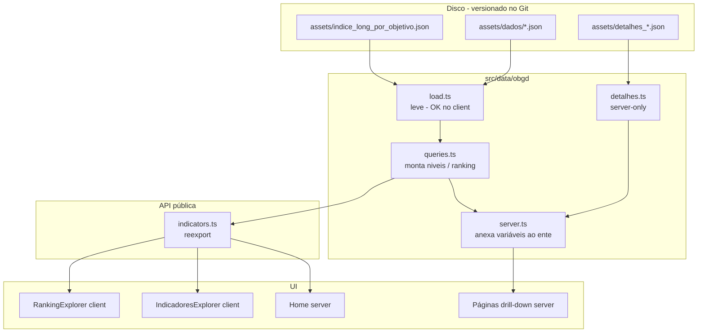
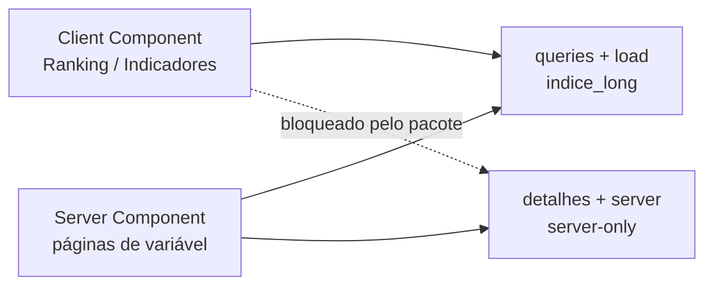
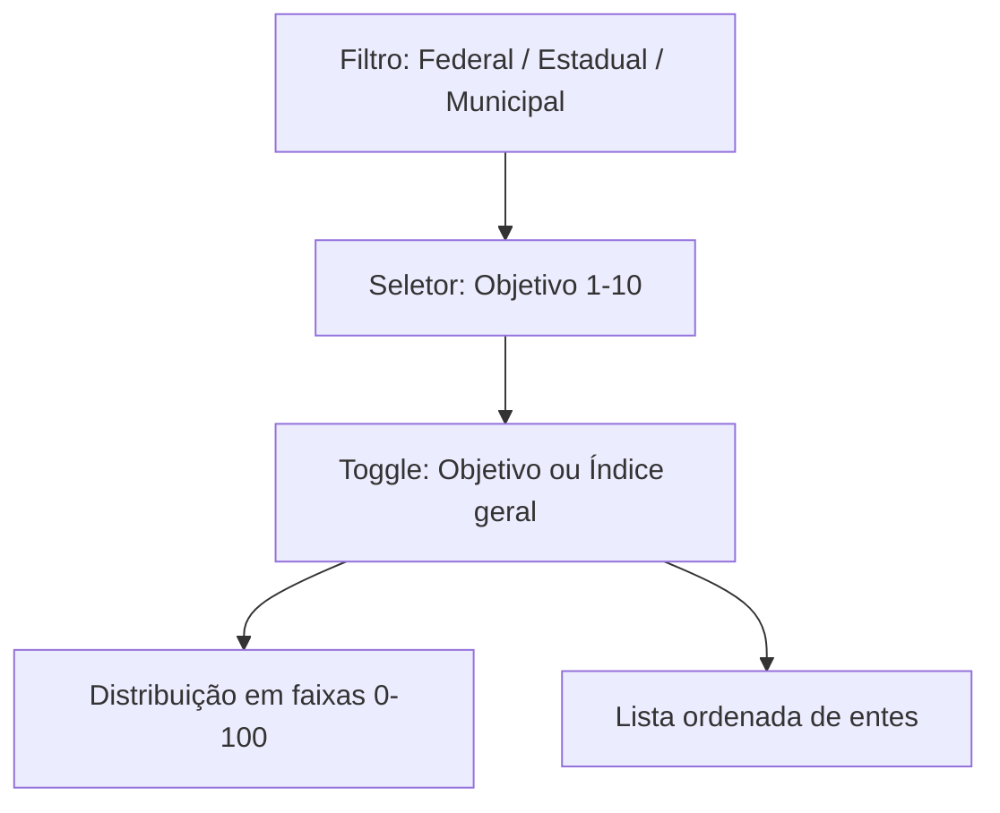
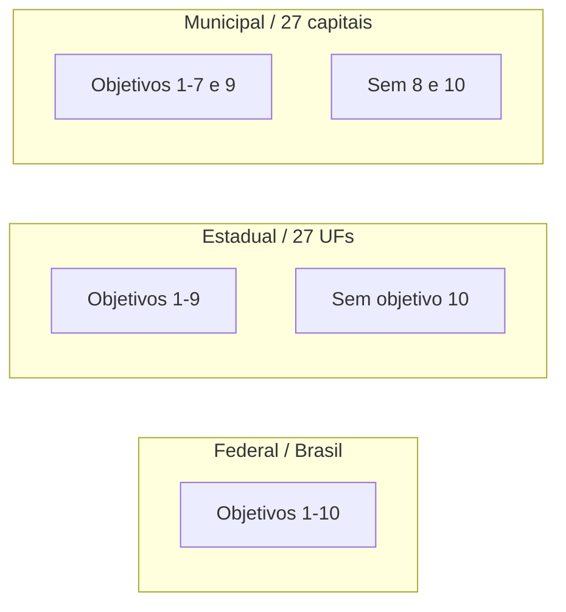
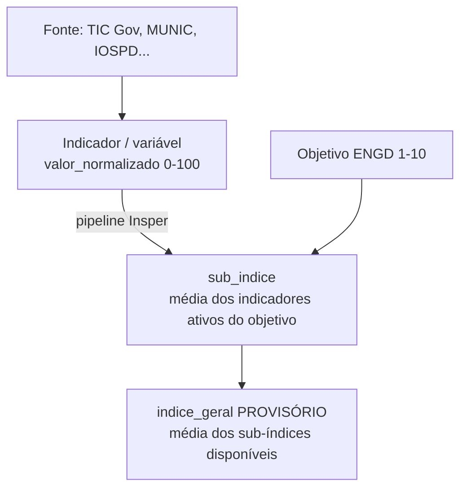

# Implementação: Ranking por Objetivo + Dados Reais

> Documento técnico e de produto sobre a migração do protótipo (mocks) para os dados canônicos do OBGD, e o ajuste de visualização **por objetivo ENGD** solicitado pelo cliente.
>
> Escopo: Ranking, Indicadores, drill-down e camada de dados · Edição do índice: **2026** · Fonte versionada: `src/data/obgd/assets/`

---

## 1. Resumo executivo

O protótipo do designer ordenava e destacava um **índice geral único**. O cliente pediu que Ranking e Indicadores passassem a trabalhar pelos **10 objetivos da ENGD** (sub-índices), alinhado à metodologia atual (não há mais índice único definitivo).

| Feedback do cliente                                                                 | O que foi feito                                                                       |
| ----------------------------------------------------------------------------------- | ------------------------------------------------------------------------------------- |
| **#1** Ranking sem clareza de qual objetivo ordena / como selecionar          | Seletor de objetivo + label explícita do critério ativo                             |
| **#2** Índice geral: Bruno diz que não existiria; outro feedback acha útil | Mantido como**referência provisória** + toggle *Objetivo \| Índice geral*  |
| **#3** Visualizações pelo índice, deveriam ser por objetivo                | Default e destaque =**sub-índice do objetivo**; dados reais no lugar dos mocks |

**Fora desta entrega:** séries temporais 2021–2025 (as imagens de referência do cliente). O dataset atual é um **snapshot** (`ano_indice = 2026`), sem histórico multi-anual do sub-índice por ente.

---

## 2. Onde estão os dados?

### 2.1 Resposta direta

| Pergunta | Resposta |
|---|---|
| **Onde o app lê?** | [`src/data/obgd/assets/`](../src/data/obgd/assets/) — **versionado no Git** (~1,9 MB) |
| **Estão no Git?** | **Sim**, o subset usado pelo app. A entrega completa continua em `src/local_assets/` (gitignored) |
| **De onde o app “puxa”?** | Imports estáticos de JSON em TypeScript (`resolveJsonModule`), em build-time / server |
| **Origem da cópia** | Subset de `local_assets/dados-v2/` (entrega Insper) |
| **Legado (não usar)** | `src/local_assets/indice_obgd/` — supersedido por `dados-v2` |

### 2.2 Por que ainda existe `local_assets` gitignored?

A entrega completa do cliente (CSVs, xlsx, docs, legado, arquivos não usados pelo app) permanece em `src/local_assets/` fora do Git. O que o **build precisa** foi copiado para `src/data/obgd/assets/` e versionado, para CI/Vercel funcionarem sem passo extra.

Para atualizar após nova entrega: ver [`src/data/obgd/assets/README.md`](../src/data/obgd/assets/README.md).

### 2.3 Inventário versionado (usado pelo app)

```
src/data/obgd/assets/
├── indice_long_por_objetivo.json   ← ★ Ranking / radar / big number
├── detalhes_nacional.json          ← drill-down (Brasil)
├── detalhes_estadual.json          ← drill-down (UFs)
├── detalhes_capitais.json          ← drill-down (capitais; categoria = sigla UF)
└── dados/
    ├── objetivo_engd.json          ← 10 objetivos
    ├── ente.json                   ← 55 entes
    ├── fonte.json                  ← 14 fontes
    └── indicador.json              ← catálogo de variáveis
```

Arquivo mais usado na UI agregada:

| Campo em`indice_long_por_objetivo`              | Uso na UI                                            |
| ------------------------------------------------- | ---------------------------------------------------- |
| `nivel` (`nacional` \| `uf` \| `capital`) | Mapeia Federal / Estadual / Municipal                |
| `unidade` / `unidade_nome`                    | Código e nome do ente                               |
| `objetivo` / `objetivo_nome`                  | Objetivo ENGD 1–10                                  |
| `sub_indice`                                    | Nota principal (0–100)                              |
| `posicao_no_objetivo`                           | Posição no ranking daquele objetivo                |
| `indice_geral`                                  | Referência provisória (repetida por linha do ente) |
| `ano_indice`                                    | Sempre**2026** nesta entrega                   |

---

## 3. De onde o código puxa os dados?

### 3.1 Fluxo de carregamento



### 3.2 Módulos

| Arquivo                                                      | Papel                                                                   |
| ------------------------------------------------------------ | ----------------------------------------------------------------------- |
| [`src/data/obgd/types.ts`](../src/data/obgd/types.ts)       | Tipos dos JSON                                                          |
| [`src/data/obgd/load.ts`](../src/data/obgd/load.ts)         | Importa catálogos +`indice_long` (árvore leve)                      |
| [`src/data/obgd/detalhes.ts`](../src/data/obgd/detalhes.ts) | Importa`detalhes_*.json` (**server-only**)                      |
| [`src/data/obgd/queries.ts`](../src/data/obgd/queries.ts)   | Monta`niveis`, ranking, médias, cobertura                            |
| [`src/data/obgd/server.ts`](../src/data/obgd/server.ts)     | `getEnteComVariaveis`, `generateStaticParams` de objetivo/variável |
| [`src/data/indicators.ts`](../src/data/indicators.ts)       | Fachada pública (substitui os mocks)                                   |
| [`src/data/objectives.ts`](../src/data/objectives.ts)       | Slugs/rotas + textos editoriais (títulos alinhados ao canônico)       |

### 3.3 Mapeamento app ↔ dados

| App (`NivelKey`) | `indice_long.nivel` | Entes                                         |
| ------------------ | --------------------- | --------------------------------------------- |
| `federal`        | `nacional`          | Brasil (`BR`) — label “Brasil” nos dados |
| `estadual`       | `uf`                | 27 UFs                                        |
| `municipal`      | `capital`           | 27 capitais (recorte municipal do MVP)        |

Objetivos: ordem do array em `objectives.ts` = IDs 1–10. Slugs de rota foram **preservados** (ex.: `gestao-e-governanca`); títulos/descrições foram alinhados a `objetivo_engd.json`.

---

## 4. Por que existe `server-only` no `package.json`?

### 4.1 O problema

Os arquivos `detalhes_*.json` somam **centenas de KB / ~MB** e só são necessários no **drill-down** (lista de variáveis de um ente × objetivo).

Ranking e Indicadores são **Client Components** (`'use client'`). Se eles importassem (mesmo indiretamente) os `detalhes_*`, o bundler embutiria esses JSON no **JavaScript do browser** — bundle enorme e dados desnecessários no cliente.

### 4.2 A solução

1. Separar carga **leve** (`indice_long` + catálogos) da carga **pesada** (`detalhes_*`).
2. Marcar o módulo pesado com:

```ts
import 'server-only'
```

em [`detalhes.ts`](../src/data/obgd/detalhes.ts) e [`server.ts`](../src/data/obgd/server.ts).

O pacote [`server-only`](https://www.npmjs.com/package/server-only) (dependência no `package.json`) **quebra o build** se algum Client Component tentar importar esse módulo. É uma trava de arquitetura, não uma feature de runtime.



### 4.3 Quando usar cada API

| Precisa de…                                      | Importar de            | Ambiente                 |
| ------------------------------------------------- | ---------------------- | ------------------------ |
| Lista de entes, sub-índices, ranking, radar      | `@/data/indicators`  | Client ou Server         |
| Variáveis /`generateStaticParams` de variável | `@/data/obgd/server` | **Somente Server** |

---

## 5. O que a UI exibe hoje

### 5.1 Ranking (`/ranking`)



- **Default:** ordenar por **sub-índice do objetivo** (`posicao_no_objetivo`).
- **Toggle:** ordenar por **índice geral** (provisório), com label clara.
- Coluna principal = critério ativo; coluna secundária = o outro valor.
- Objetivos **sem cobertura** no nível ficam desabilitados (ex.: obj. 10 em estadual; obj. 8 e 10 em municipal).
- Federal: pula a lista e abre o detalhe do ente Brasil.

### 5.2 Detalhe do ente (`/ranking/[nivel]/[ente]`)

- Big number: **sub-índice do objetivo ativo** (+ posição no ranking daquele objetivo).
- Texto secundário: índice geral (provisório).
- Radar: 10 eixos (objetivos) × ente vs média do nível.
- Distribuição: faixas do **sub-índice do objetivo**, não do índice geral.
- Lista: os 10 objetivos com sub-índice (ou “Sem dados”).

### 5.3 Objetivo e variável

- Lista de indicadores reais de `detalhes_*` + metadados de `indicador.json` / `fonte.json`.
- Página da variável: nota normalizada, pergunta, fonte, ano da fonte, tabela de campos — **sem** checklist Sim/Não mockado.

### 5.4 Indicadores (`/indicadores`)

- Filtros: nível, até 3 entes, objetivo.
- Badge fixo **Edição 2026** (não há filtro de ano útil no snapshot).
- Radar multi-ente + distribuição do sub-índice do objetivo.
- Na lista de entes: número principal = sub-índice (se objetivo selecionado); índice geral como secundário.

### 5.5 Home e Objetivos

- Home: herda scores reais via o mesmo módulo (sem redesign).
- Página Objetivos: títulos/summaries canônicos; conteúdo editorial (recomendações) mantido; **sem** gráficos de evolução.

---

## 6. Cobertura real dos dados (importante para o cliente)



| Nível            | Objetivos com sub-índice |
| ----------------- | ------------------------- |
| Nacional (Brasil) | 1–10                     |
| UF                | 1–9                      |
| Capital           | 1–7, 9                   |

Outros fatos do snapshot:

- `ano_indice` = **2026** em todas as linhas de `indice_long`.
- Cada indicador em `indicador_valor` tem **um único ano** (o da fonte usada na edição) — tipicamente 2023, 2024 ou 2025 conforme a fonte.
- **Não há** série 2021–2025 do sub-índice agregado por ente nos arquivos atuais.
- `indice_geral` está marcado como **provisório** na entrega do Insper; rankings oficiais do MVP devem preferir `posicao_no_objetivo`.

Exemplo de sanidade (edição 2026):

| Ente   | Métrica                         | Valor aproximado |
| ------ | -------------------------------- | ---------------- |
| Brasil | Sub-índice Obj. 1 (Governança) | 70,97            |
| Brasil | Índice geral (provisório)      | 57,57            |
| Piauí | Índice geral                    | 93,74            |
| Piauí | Sub-índice Obj. 1               | 100,0            |

---

## 7. Hierarquia conceitual (o que estamos medindo)



O frontend **não recalcula** o índice: só filtra, ordena e exibe o que já veio calculado.

---

## 8. Critérios de aceite (status)

| Critério                                                                  | Status                                   |
| -------------------------------------------------------------------------- | ---------------------------------------- |
| No Ranking fica óbvio qual objetivo ordena e como trocar                  | Atendido                                 |
| Índice geral secundário + modo de ordenação explícito                 | Atendido                                 |
| Visualizações/rankings usam sub-índice por objetivo como eixo principal | Atendido                                 |
| Números batem com`indice_long_por_objetivo.json`                        | Atendido (validado no build)             |
| Séries temporais como nas imagens do cliente                              | **Não** — falta dado multi-anual |

---

## 9. Como rodar / validar localmente

1. Clonar o repo (os JSON em `src/data/obgd/assets/` já vêm versionados).
2. `npm install` (inclui a dependência `server-only`).
3. `npm run dev` — exercitar `/ranking`, `/indicadores` e um drill-down até variável.
4. `npm run build` — gera páginas estáticas de objetivo/variável a partir dos dados reais.

Checklist rápido de produto:

- [ ] Em Ranking estadual, trocar o objetivo muda a ordem e a label.
- [ ] Toggle “Índice geral” reordena e deixa o modo explícito.
- [ ] Obj. 10 desabilitado em estadual; obj. 8 e 10 desabilitados em municipal.
- [ ] Detalhe do ente mostra sub-índice como big number.
- [ ] Lista de variáveis de um objetivo usa nomes/fontes reais (não checklist mock).

---

## 10. Próximos passos naturais (fora do escopo atual)

1. **Série temporal** — quando houver snapshots multi-edição ou `indicador_valor` multi-ano por ente, implementar os gráficos das imagens (evolução por objetivo / detalhamento 6.3).
2. **Painel estilo PEMOB** (`/painel`) — layout de filtros + big number + ranking + scatter, descrito em [`mvp-dashboard.md`](./mvp-dashboard.md).
3. **Remoção eventual do índice geral** — se a metodologia fechar sem ele, retirar o toggle e a coluna auxiliar.
4. **Atualizar assets versionados** — ao receber nova entrega em `local_assets`, copiar o subset para `src/data/obgd/assets/` (ver README da pasta) e commitar.

---

## 11. Referências

| Documento / recurso            | Caminho                                                                                                          |
| ------------------------------ | ---------------------------------------------------------------------------------------------------------------- |
| Guia de estudo dos dados e MVP | [`docs/mvp-dashboard.md`](./mvp-dashboard.md)                                                                   |
| Assets versionados (build)     | [`src/data/obgd/assets/`](../src/data/obgd/assets/)                                                             |
| README de atualização          | [`src/data/obgd/assets/README.md`](../src/data/obgd/assets/README.md)                                           |
| Entrega completa (gitignored)  | `src/local_assets/dados-v2/`                                                                                   |
| Camada de queries              | [`src/data/obgd/queries.ts`](../src/data/obgd/queries.ts)                                                       |
| Ranking UI                     | [`src/components/ranking/ranking-explorer.tsx`](../src/components/ranking/ranking-explorer.tsx)                 |
| Indicadores UI                 | [`src/components/indicadores/indicadores-explorer.tsx`](../src/components/indicadores/indicadores-explorer.tsx) |

---

*Última atualização: jul/2026 · Implementação alinhada aos feedbacks de Ranking / Indicadores / visualização por objetivo.*
