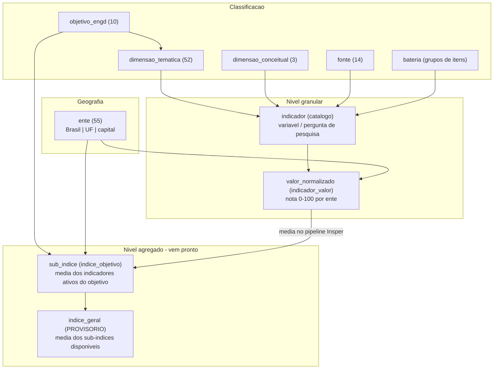
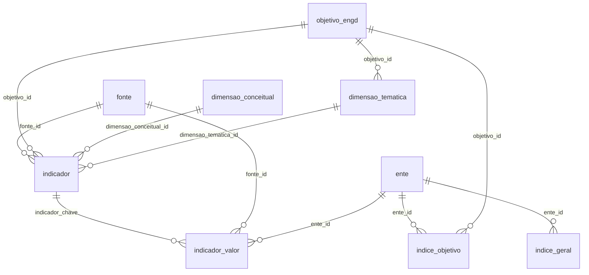
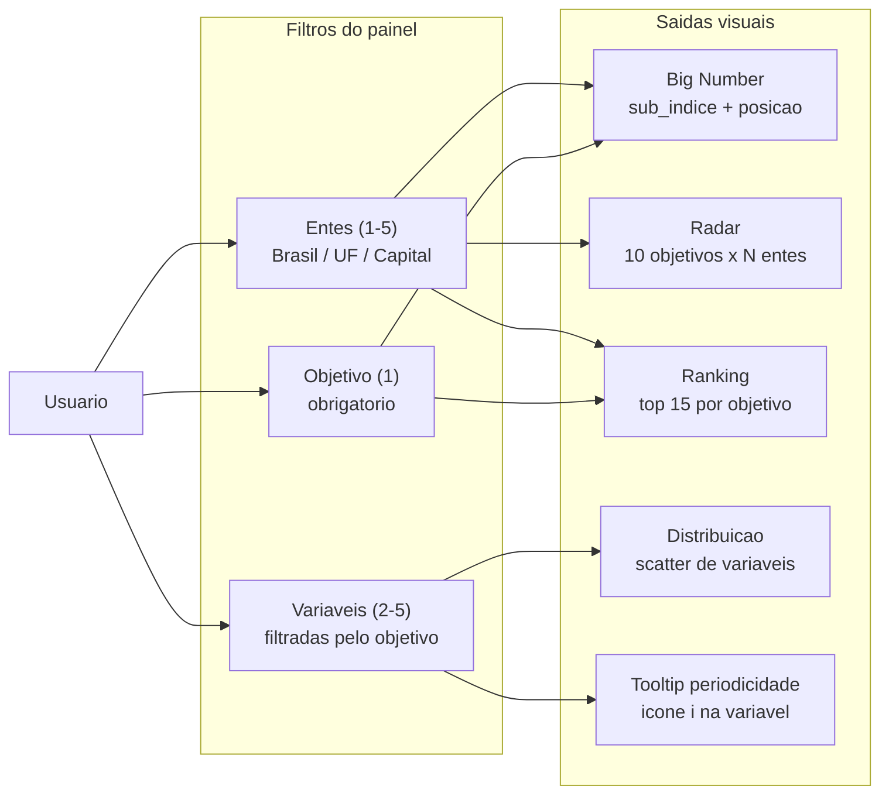
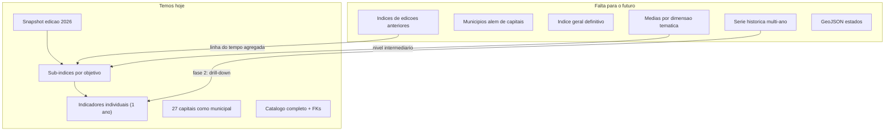
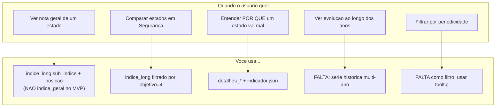

# MVP do Dashboard OBGD — Guia de Estudo

> Documento de referência para entender os dados fornecidos pelo cliente, o escopo acordado do MVP, os gráficos possíveis e o que ainda falta para features futuras.
>
> Última atualização: jul/2026 · Fonte canônica: `src/local_assets/dados-v2/`
>
> **Status:** planejamento e estudo — a implementação do dashboard ainda não foi iniciada.

---

## 1. O que o cliente espera (visão geral)

O Observatório Brasileiro de Governo Digital mede a **maturidade digital** do setor público brasileiro com base nos **10 objetivos da ENGD** (Estratégia Nacional de Governo Digital, Decreto 12.069/2024).

O dashboard deve permitir que o usuário **navegue entre recortes temáticos, geográficos e temporais** para explorar índices e indicadores. Na prática, o cliente descreveu uma plataforma com:

- **Big Number** — indicador principal consolidado por localidade
- **Filtros** — objetivo/tema, variáveis, região (Brasil/UF/município), periodicidade
- **Gráficos dinâmicos** — principalmente séries temporais e comparativos, gerados conforme os filtros
- **Rankings** — comparar entes federativos
- **Drill-down** — descer do índice agregado até indicadores individuais

### O que foi acordado para o MVP (conversa com Luiza, Gabriel e Suelane)

| Tema | Decisão para o MVP |
|---|---|
| Recorte municipal | **Capitais** representam o nível municipal (não há municípios genéricos nos dados) |
| Big Number | **Sub-índice do objetivo selecionado** + posição no ranking (não usar `indice_geral`) |
| Série temporal | **Fora do MVP** — entra quando o usuário desce ao detalhe do indicador (fase 2) |
| Periodicidade | **Não é filtro** — exibir como tooltip informativo ao lado da variável |
| Mapa coroplético | **Fora do MVP** |
| Layout | Estilo PEMOB: card intro + 2 colunas de filtros + área de gráficos |

---

## 2. O que o cliente forneceu

### 2.1 Duas entregas de dados

| Pasta | Status | Formato |
|---|---|---|
| `indice_obgd/` | Legado (supersedido) | 9 CSVs flat por escopo (nacional, estadual, capitais) |
| **`dados-v2/`** | **Canônico** | JSON relacional + CSVs/JSONs flat derivados |

**Regra:** `dados-v2/dados/` é a fonte única de verdade. Os arquivos na raiz de `dados-v2/` são views de conveniência geradas a partir dele.

### 2.2 Estrutura de `dados-v2/`

```
dados-v2/
├── README.md
├── dados/                          ← MODELO RELACIONAL (canônico)
│   ├── SCHEMA.md / schema.json
│   ├── meta.json                   ← ano_indice = 2026
│   ├── fonte.json                  ← 14 fontes de dados
│   ├── objetivo_engd.json          ← 10 objetivos ENGD
│   ├── dimensao_conceitual.json    ← 3 dimensões teóricas
│   ├── dimensao_tematica.json      ← 52 dimensões temáticas
│   ├── ente.json                   ← 55 entes (Brasil + 27 UFs + 27 capitais)
│   ├── indicador.json              ← 477 variáveis no catálogo (343 ativas)
│   ├── indicador_valor.json        ← 4.093 observações normalizadas
│   ├── indice_objetivo.json        ← sub-índices por ente × objetivo
│   └── indice_geral.json           ← índice geral (PROVISÓRIO)
│
├── indice_long_por_objetivo.json   ← MELHOR ARQUIVO PARA GRÁFICOS AGREGADOS
├── indice_nacional.json
├── indice_estadual.json
├── indice_capitais.json
├── ranking_estadual.json
├── ranking_capitais.json
├── detalhes_nacional.json
├── detalhes_estadual.json
└── detalhes_capitais.json
```

### 2.3 Avisos importantes da entrega

1. **`indice_geral` é provisório** — pode ser removido; rankings devem ser por objetivo.
2. **Escala 0–100** para `sub_indice`, `indice_geral` e `valor_normalizado`.
3. **Snapshot** — cada fonte contribui com **1 ano** (o mais recente) na edição atual.
4. **`ano_indice` (2026)** é o ano da **edição do índice**, não o ano das fontes.

---

## 3. O que os dados significam

### 3.1 Hierarquia conceitual (como o índice é construído)

O Insper já calculou e normalizou os valores. O frontend **não recalcula o índice** — apenas exibe, filtra e agrega para gráficos.



**Em linguagem simples:**

| Conceito | O que é | Exemplo |
|---|---|---|
| **Objetivo** | Um dos 10 eixos da ENGD | "Governança do Governo Digital" |
| **Dimensão temática** | Subdivisão editorial/capítulo dentro do objetivo | "Estrutura de governança" |
| **Dimensão conceitual** | Lente teórica (3 tipos) | Capacidade, Uso em políticas, Valor público |
| **Indicador / variável** | Pergunta específica de uma pesquisa | "O órgão possui área de TI?" (TIC Gov B1) |
| **Sub-índice** | Nota 0–100 do objetivo para um ente | PI = 93,74 em Governança |
| **Índice geral** | Média dos sub-índices (provisório) | Brasil = 57,57 |
| **Ente** | Unidade geográfica analisada | Brasil, São Paulo, Manaus |

### 3.2 Metodologia recente (decisão 26/06/2026)

Conversa com Bruno Oliveira (via Luiza):

- Calcula-se **média por dimensão** → depois **média por objetivo**
- **Não há mais índice único definitivo** — ranqueamento é **por objetivo**
- 49 variáveis foram excluídas por redundância (392 → 343 ativas)
- Variáveis em **bateria** (mesma pergunta-mãe) contam juntas como subscore

### 3.3 Os 10 objetivos ENGD

| ID | Nome |
|---|---|
| 1 | Governança do Governo Digital |
| 2 | Qualidade dos Serviços Digitais |
| 3 | Identificação Única |
| 4 | Segurança e LGPD |
| 5 | Dados e Interoperabilidade |
| 6 | Infraestrutura |
| 7 | Inovação e Tecnologias Emergentes |
| 8 | Eficiência e Processos |
| 9 | Transparência e Participação |
| 10 | Competências em Governo Digital |

### 3.4 Geografia disponível


| `ente.tipo` | Quantidade | `codigo` | Observação |
|---|---|---|---|
| `nacional` | 1 | `"BR"` | Brasil agregado |
| `uf` | 27 | Sigla UF (`"SP"`, `"PI"`) | Estados |
| `capital` | 27 | Código IBGE (`"1302603"`) | Capitais — **recorte municipal do MVP** |

**Atenção — inconsistência de nomes entre arquivos:**

| Contexto | Nacional | Estadual | Capitais |
|---|---|---|---|
| `ente.tipo` | `nacional` | `uf` | `capital` |
| `indice_long.nivel` | `nacional` | `uf` | `capital` |
| `detalhes_*.categoria` | `"Total"` | sigla UF | sigla UF (não IBGE!) |

Para juntar `detalhes_capitais` com `ente`, use `ente.uf_sigla` ↔ `detalhes.categoria`.

### 3.5 Periodicidade (metadado, não série)

As fontes têm `anos_disponiveis` que permitem **inferir** periodicidade:

| Fonte | Padrão típico | Periodicidade inferida |
|---|---|---|
| TIC Gov | 2013, 2015, 2017... | Bienal |
| MUNIC | 2019, 2024 | Quinquenal |
| PNAD TIC, ESTADIC | quase anual | Anual |

No snapshot atual, cada fonte contribui **só com 1 ano**. A periodicidade serve para o tooltip: *"Variável bienal, atualizada pela última vez em 2023"*.

---

## 4. Como as entidades se relacionam

### 4.1 Diagrama entidade-relacionamento



### 4.2 Fluxo de uso no dashboard (MVP)



---

## 5. Arquivos flat — quando usar cada um

### 5.1 `indice_long_por_objetivo.json` ⭐ principal para gráficos agregados

Uma linha por **(nível, unidade, objetivo)**. É o arquivo mais versátil para o dashboard.

| Campo | Significado |
|---|---|
| `nivel` | `nacional` \| `uf` \| `capital` |
| `unidade` | `ente.codigo` (BR, sigla UF ou IBGE) |
| `unidade_nome` | Nome legível |
| `objetivo` / `objetivo_nome` | Objetivo ENGD |
| `sub_indice` | Nota 0–100 do objetivo |
| `indice_geral` | Índice geral do ente (repetido; provisório) |
| `posicao_no_objetivo` | Ranking dentro do objetivo entre pares do mesmo nível |
| `ano_indice` | Edição (2026) |

**469 linhas** = 55 entes × ~8,5 objetivos em média (nem todos têm os 10).

### 5.2 `indice_*.json` — sub-índices por escopo

| Arquivo | Linhas | Uso |
|---|---|---|
| `indice_nacional.json` | 10 | Perfil do Brasil (10 barras/radar) |
| `indice_estadual.json` | 270 | 27 UFs × 10 objetivos |
| `indice_capitais.json` | 270 | 27 capitais × 10 objetivos |

Mesmas colunas do `indice_long`, mas separados por escopo.

### 5.3 `ranking_*.json` — ranking por índice geral (provisório)

| Arquivo | Conteúdo |
|---|---|
| `ranking_estadual.json` | 27 UFs ordenadas por `indice_geral` |
| `ranking_capitais.json` | 27 capitais ordenadas por `indice_geral` |

**No MVP:** preferir ranking derivado de `posicao_no_objetivo` em `indice_long_por_objetivo` (por objetivo).

### 5.4 `detalhes_*.json` — drill-down de indicadores

Uma linha por **(ente, objetivo, indicador)** com valor individual.

| Campo | Significado |
|---|---|
| `categoria` | `"Total"` (nacional) ou sigla UF |
| `objetivo` / `objetivo_nome` | Objetivo ENGD |
| `fonte` / `indicador` | Identificação da variável |
| `descricao` | Nome legível |
| `valor_normalizado` | Nota 0–100 do indicador |
| `ano_fonte` | Ano da fonte usada no snapshot |
| `escala` | Tipo de escala original |
| `populacao` | Público-alvo da pergunta |

| Arquivo | Linhas aprox. |
|---|---|
| `detalhes_nacional.json` | 343 |
| `detalhes_estadual.json` | 1.971 |
| `detalhes_capitais.json` | 1.782 |

---

## 6. Gráficos possíveis

### 6.1 Com os dados atuais (MVP)

| Gráfico | Tipo | Fonte de dados | Filtros que afetam |
|---|---|---|---|
| **Big Number** | KPI numérico | `indice_long` → `sub_indice` + `posicao_no_objetivo` | Ente principal + objetivo |
| **Radar** | `RadarChart` | `indice_long` — 10 eixos (objetivos) | Entes selecionados (1–5) |
| **Ranking horizontal** | `BarChart` vertical | `indice_long` filtrado por `nivel` + `objetivo` | Objetivo + nível do ente principal |
| **Barras agrupadas** | `BarChart` | `indice_long` — comparar entes em objetivos | Entes + objetivos |
| **Distribuição (scatter)** | `ScatterChart` | `detalhes_*` — todos os entes do nível | Variáveis + entes (destaque) |
| **Heatmap UF × objetivo** | Grid / barras empilhadas | pivot de `indice_estadual` | Escopo estadual |
| **Tabela drill-down** | Tabela | `detalhes_*` join `indicador` | Ente + objetivo |
| **Tooltip periodicidade** | Ícone `i` | `fonte.anos_disponiveis` + `indicador.anos_observados` | Por variável |

### 6.2 Escopo planejado do MVP (ainda não implementado)

| Gráfico / feature | Prioridade no MVP |
|---|---|
| Big Number (sub-índice) | Alta |
| Radar (10 objetivos) | Alta |
| Ranking por objetivo | Alta |
| Distribuição (scatter) | Alta |
| Tooltip periodicidade | Alta |
| Tabela drill-down | Média |
| Heatmap | Baixa (opcional) |

Rota prevista: `/painel` · Layout de referência: dashboard PEMOB do projeto `observatorio`.

### 6.3 Fora do MVP (features futuras)

| Gráfico | Por que não dá ainda |
|---|---|
| **Linha / evolução temporal** | Snapshot sem multi-ano por indicador×ente |
| **Mapa coroplético** | Sem GeoJSON; fora do escopo acordado |
| **Comparador (2–4 entes)** | Dados existem; feature futura |
| **Perfis `/estados/[uf]`** | Dados existem; feature futura |
| **Filtro de periodicidade** | Metadado informativo apenas |
| **Municípios genéricos** | Só 27 capitais como recorte municipal |

---

## 7. O que falta em termos de dados (features futuras)

### 7.1 Série temporal (prioridade alta — Gabriel)

**O que o cliente quer:** gráficos de linha mostrando evolução de variáveis ao longo do tempo, especialmente no drill-down de indicadores.

**O que temos hoje:**

- `indicador_valor.json`: 4.093 observações, mas **0 pares indicador×ente com mais de 1 ano**
- Cada fonte contribui 1 ano no snapshot da edição 2026
- `fonte.anos_disponiveis` lista anos históricos, mas **sem valores associados**

**O que Suelane esclareceu:** série temporal e periodicidade entram **quando o usuário desce o nível de detalhamento** (indicador individual), não no painel agregado.

**O que Gabriel está preparando (previsão: integração até sexta):**

| Fonte | Série histórica |
|---|---|
| Censo Escolar (INEP) | 1996–2024 |
| PNAD TIC (IBGE) | 2016–2024 |
| ANATEL | 2016–2024 (talvez 2001) |
| MUNIC (IBGE) | 6 edições |
| ESTADIC (IBGE) | 2012–2024 |
| iGovSISP | 2023–2025 |
| iESGo (TCU) | 2024 |
| CETIC (TIC Gov etc.) | Automação parcial |

**Desafio técnico futuro:** bases muito pesadas — definir estratégia (subset por indicador, pré-processamento em build, lazy load).

### 7.2 Municípios além de capitais

**O que o cliente mencionou:** filtrar por "município Y".

**O que temos:** 27 capitais como único recorte municipal. Fontes como ANATEL e MUNIC têm granularidade municipal na origem, mas o índice é agregado para capitais.

**O que falta:** expansão de `ente.json` com municípios ou entrega separada de scores municipais.

### 7.3 Índice geral definitivo

**O que temos:** `indice_geral` marcado como `provisorio: true` (divergência pontual no build do Gabriel vs. Bruno).

**O que falta:** confirmação metodológica final — se haverá ou não número único para ranquear entes globalmente.

### 7.4 Médias por dimensão temática

**O que temos:** sub-índices por objetivo (`indice_objetivo`), indicadores individuais (`detalhes_*`).

**O que não temos pré-calculado:** `indice_dimensao.json` — média por dimensão temática (52 dimensões).

**Impacto:** gráficos intermediários entre objetivo e indicador (ex.: "Como está a dimensão Estrutura de governança?").

### 7.5 Edições históricas do índice

**O que temos:** `ano_indice: 2026` (uma edição).

**O que falta para linha do tempo do índice agregado:** snapshots de edições anteriores (2024, 2025...) com `indice_objetivo` multi-anual.

### 7.6 GeoJSON para mapas

**O que falta:** arquivo GeoJSON dos estados brasileiros (IBGE) para mapa coroplético.

### 7.7 Resumo visual — lacunas



---

## 8. Operações que você precisa derivar (não vêm prontas)

Estas transformações são responsabilidade do frontend (ou de um passo de build), pois não existem como arquivos dedicados nos dados entregues.

### 8.1 Tabela de operações

| Operação | Entrada | Saída | Complexidade | Usado em |
|---|---|---|---|---|
| **Ranking por objetivo** | `indice_long` filtrado por `nivel` + `objetivo` | Lista ordenada por `posicao_no_objetivo` | Baixa — campo já existe | Ranking, Big Number |
| **Radar multi-ente** | `indice_long` × N entes | Matriz objetivo × ente | Baixa — pivot simples | Radar |
| **Pivot UF × objetivo** | `indice_estadual` | Matriz 27×10 | Baixa | Heatmap |
| **Join detalhes ↔ indicador** | `detalhes_*` + `indicador.json` | Metadados completos (pergunta, bateria, status) | Média | Tabela drill-down |
| **Join detalhes ↔ ente** | `detalhes.categoria` + `ente.uf_sigla` | Nome legível da capital | Média — atenção à inconsistência | Distribuição, tabelas |
| **Inferir periodicidade** | `fonte.anos_disponiveis` | `anual` \| `bienal` \| `quinquenal` | Média — heurística de gaps | Tooltip |
| **Label de periodicidade** | periodicidade + `indicador.anos_observados` | Texto humanizado | Baixa | Tooltip |
| **Distribuição de indicador** | `detalhes_*` filtrado por fonte+indicador | Todos os valores do nível + destaque | Média | Scatter |
| **Filtrar indicadores ativos** | `indicador.json` | Só `status === 'ativo'` (343) | Baixa | Filtro de variáveis |
| **Agrupar por bateria** | `indicador.bateria` | Grupos de itens da mesma pergunta-mãe | Média | UI futura |
| **Comparar estado vs. capital** | `indice_long` UF + capital da mesma UF | Par PI/Teresina, AM/Manaus | Média — join por `uf_sigla` | Comparador, editorial |
| **Média por região** | `indice_long` + `ente.regiao` | Média de sub-índices por macrorregião | Média | Análise regional |
| **Média por dimensão temática** | `detalhes_*` agrupado por `dimensao_tematica_id` | Subscore por dimensão | **Alta** — não pré-calculado | Gráfico futuro |
| **Série temporal** | `indicador_valor` multi-anual (futuro) | Pontos ano × valor por ente | **Alta** — dados não entregues | Evolução fase 2 |
| **Completude / cobertura** | `n_objetivos_com_dados`, `n_indicadores` | % de dados disponíveis | Baixa | Badges, avisos |

### 8.2 Exemplo: como montar o ranking por objetivo

```
Entrada:
  indice_long_por_objetivo.json
  filtros: nivel = "uf", objetivo = 4

Operação:
  1. filter(row => row.nivel === "uf" && row.objetivo === 4)
  2. sort por posicao_no_objetivo (já vem calculado)
  3. map para { posicao, unidade_nome, sub_indice }

Saída:
  1º PI — 95,2
  2º MG — 91,8
  ...
```

### 8.3 Exemplo: como montar a distribuição (scatter)

```
Entrada:
  detalhes_estadual.json
  indicador: fonte=tic_gov, indicador=B1
  entes selecionados: ["PI", "AM"]

Operação:
  1. filter por objetivo + fonte + indicador
  2. para cada linha: { ente: categoria, valor: valor_normalizado }
  3. marcar selecionados vs. demais (cor diferente)

Saída:
  27 pontos no eixo X (valor 0-100), eixo Y = índice da variável
```

### 8.4 Exemplo: periodicidade (tooltip)

```
Entrada:
  indicador.chave = "tic_gov/B1"
  → indicador.fonte_id = "tic_gov"
  → fonte.anos_disponiveis = [2013, 2015, 2017, 2019, 2021, 2023]
  → indicador.anos_observados = [2021, 2023]

Operação:
  1. inferir periodicidade: gaps médios ≈ 2 → "bienal"
  2. ultimo ano: max(anos_observados) = 2023
  3. montar label

Saída:
  "Variável bienal, atualizada pela última vez em 2023."
```

---

## 9. Mapa mental rápido



---

## 10. Referências no projeto

| Recurso | Caminho |
|---|---|
| Dados canônicos | `src/local_assets/dados-v2/dados/` |
| Schema completo | `src/local_assets/dados-v2/dados/SCHEMA.md` |
| Views flat | `src/local_assets/dados-v2/*.json` |
| Estrutura do site (produto) | `src/local_assets/estrutura-do-site.md` |
| Dados e indicadores (legado) | `src/local_assets/dados-e-indicadores.md` |
| Dashboard de referência (layout) | `observatorio/src/app/projetos/(projetos)/dashboard/` |

---

## 11. Glossário

| Termo | Definição |
|---|---|
| **ENGD** | Estratégia Nacional de Governo Digital (Decreto 12.069/2024) |
| **Ente** | Unidade geográfica: Brasil, UF ou capital |
| **Objetivo** | Um dos 10 eixos estratégicos da ENGD |
| **Sub-índice** | Nota 0–100 de um objetivo para um ente |
| **Indicador / variável** | Pergunta individual de uma fonte de pesquisa |
| **Fonte** | Base de dados de origem (TIC Gov, MUNIC, IOSPD...) |
| **Bateria** | Grupo de itens da mesma pergunta-mãe (contam como 1 variável) |
| **Edição** | Versão do índice (`ano_indice = 2026`) |
| **Snapshot** | Cada fonte contribui 1 ano (o mais recente) na edição |
| **Provisório** | `indice_geral` pode ser removido da metodologia final |
