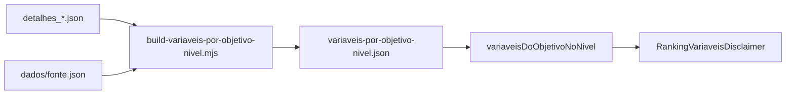

# Disclaimer de variáveis no ranking por objetivo

> Transparência do painel de indicadores que compõe o **Índice** de um objetivo da ENGD no nível de governo selecionado (estadual / municípios).
>
> **Rota:** [`/ranking`](../src/app/(app)/ranking/page.tsx) com `por=objetivos`  
> **Exemplo:** `/ranking?nivel=estadual&por=objetivos&objetivo=gestao-e-governanca`
>
> **Última atualização:** 2026-08-26

---

## 1. Visão geral

No ranking ordenado por objetivo, a plataforma informa **quantas variáveis** entram no índice daquele **nível × objetivo** e permite **listar quais são**, sem sair da página.

| Aspecto | Decisão |
| --- | --- |
| Escopo da UI | Modo `por=objetivos` em `/ranking` (estadual e municípios) |
| Contagem | Painel de `detalhes_*` do nível — **não** o catálogo global de indicadores |
| Lista | Accordion shadcn (`Ver quais são`) com nome + fonte |
| Bundle | JSON pré-agregado leve no client; sem importar `detalhes_municipios.json` |
| Fora de escopo | Modo `por=tematicas`; link para `/objetivos/{slug}` (catálogo nacional) |

**Por que não usar o catálogo global?** O mesmo objetivo ENGD pode ter dezenas de indicadores ativos no Brasil e apenas um (ou poucos) no painel estadual/municipal. Ex.: Governança (`gestao-e-governanca`) — nacional **29**, estadual **1**, municipal **1**. Contar pelo catálogo global desinformaria o leitor do ranking subnacional.

---

## 2. Comportamento na UI

1. O usuário escolhe nível (estadual / municípios) e um objetivo da ENGD.
2. Abaixo da blurb “Este objetivo avalia…”, aparece:
   - *Neste nível, este índice usa **N** variável(is).*
   - Trigger **Ver quais são** (Accordion) que expande a lista.
3. Cada item mostra o nome legível (`descricao` do detalhe) e o nome da fonte (catálogo `fonte.json`).
4. Se `N = 0` (objetivo sem linhas em `detalhes_*` naquele nível), o bloco **não** é renderizado — alinhado aos chips sem cobertura.

Componentes:

| Arquivo | Papel |
| --- | --- |
| [`ranking-explorer.tsx`](../src/components/ranking/ranking-explorer.tsx) | Obtém a lista via helper e monta o disclaimer no modo objetivos |
| [`ranking-variaveis-disclaimer.tsx`](../src/components/ranking/ranking-variaveis-disclaimer.tsx) | Copy + Accordion shadcn |
| [`variaveis-por-objetivo-nivel.ts`](../src/data/obgd/variaveis-por-objetivo-nivel.ts) | API client-safe `variaveisDoObjetivoNoNivel(nivel, objetivoNumero)` |

---

## 3. Origem dos dados

### 3.1 Fonte de verdade do painel

| Nível UI (`NivelKey`) | Arquivo de detalhes | `DataNivel` |
| --- | --- | --- |
| `federal` | `detalhes_nacional.json` | `nacional` |
| `estadual` | `detalhes_estadual.json` | `uf` |
| `municipios` | `detalhes_municipios.json` | `municipio` |

Dentro de um nível, **todos os entes compartilham o mesmo conjunto** de conceitos (`concept_id`); só o `valor_normalizado` muda. Por isso a contagem do “recorte” não depende de um ente selecionado.

### 3.2 Asset pré-agregado

| Arquivo | Conteúdo |
| --- | --- |
| [`variaveis-por-objetivo-nivel.json`](../src/data/obgd/assets/variaveis-por-objetivo-nivel.json) | `{ federal \| estadual \| municipios → { "1"…"10" → VariavelDoRecorte[] } }` |

Cada `VariavelDoRecorte`:

| Campo | Origem |
| --- | --- |
| `id` | `concept_id` ou `fonte/indicador` |
| `nome` | `descricao` do detalhe (fallback: código do indicador) |
| `fonte` | `nome` em `dados/fonte.json` (fallback: id da fonte) |

Listas ordenadas por `nome` (`pt-BR`). Objetivos sem linhas no nível omitem a chave (helper devolve `[]`).

### 3.3 Contagens de referência (snapshot atual)

Objetivo 1 — Governança do Governo Digital:

| Nível | N |
| ---: | ---: |
| Federal | 29 |
| Estadual | 1 |
| Municípios | 1 |

Outros extremos: objetivos 7 e 8 sem painel municipal; objetivo 10 sem painel estadual/municipal no snapshot.

---

## 4. Geração do asset

```bash
node scripts/build-variaveis-por-objetivo-nivel.mjs
```

O script:

1. Lê `detalhes_nacional.json`, `detalhes_estadual.json`, `detalhes_municipios.json` e `dados/fonte.json`.
2. Agrupa por objetivo, deduplica por `concept_id` (ou `fonte/indicador`).
3. Escreve `src/data/obgd/assets/variaveis-por-objetivo-nivel.json`.

Também é disparado ao final de [`sync-obgd-assets-from-v4.mjs`](../scripts/sync-obgd-assets-from-v4.mjs), para manter o mapa alinhado quando os detalhes são regenerados.



---

## 5. O que não fazer

- **Não** usar `indicadoresDoObjetivo` / página `/objetivos/[slug]` como contagem do ranking estadual ou municipal — isso é o catálogo **global** (≈ painel nacional).
- **Não** importar `detalhes_*.json` no client do ranking — o JSON pré-agregado existe justamente para isso.
- **Não** exibir disclaimer com `N = 0` (objetivo sem cobertura no nível).

---

## 6. Relacionados

- Sync e estrutura de assets: [`integracao-dados-v3-tags.md`](./integracao-dados-v3-tags.md) (§0 assets-v4)
- Ranking por objetivo (histórico): [`implementacao-ranking-por-objetivo.md`](./implementacao-ranking-por-objetivo.md)
- Drill-down com notas por variável: [`ObjetivoVariaveis`](../src/components/drilldown/objetivo-variaveis.tsx) em `/ranking/{nivel}/{ente}/{objetivo}`
- Metodologia completa (PDF): [`public/metodologia-completa.pdf`](../public/metodologia-completa.pdf)
