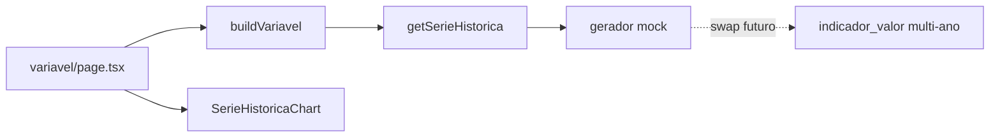

# Série histórica — protótipo com mock

> Documento técnico sobre o gráfico de evolução temporal no drill-down de variável: o que foi implementado, o que foi assumido e o checklist de integração quando os dados multi-ano forem entregues.
>
> Escopo: página `/ranking/[nivel]/[ente]/[objetivo]/[variavel]` · Biblioteca: Recharts · Edição do índice atual: **2026**
>
> Contexto de produto / lacuna de dados: [`mvp-dashboard.md`](./mvp-dashboard.md) §7.1

---

## 1. Resumo

O dataset versionado em `src/data/obgd/assets/` é um **snapshot**: cada indicador × ente tem **um único ano** (`ano_fonte` / `ano` em `indicador_valor`). Ainda assim, a UI de detalhe da variável já precisa do gráfico de linha.

**Solução:** contrato estável na aplicação (`serieHistorica: { ano, valor }[]`) + repositório `getSerieHistorica` que **hoje gera mock determinístico**. Quando Gabriel entregar a série multi-ano, só a implementação do repositório muda; página e gráfico permanecem.

| Camada | Status |
|---|---|
| Contrato UI (`SerieHistoricaPonto`) | Pronto |
| Gráfico Recharts (`SerieHistoricaChart`) | Pronto |
| Badge “Dados ilustrativos” | Pronto (enquanto `serieHistoricaMock`) |
| Dados reais multi-ano | **Pendente** (entrega Gabriel) |

---

## 2. O que foi feito

### 2.1 Arquivos

| Arquivo | Papel |
|---|---|
| [`src/data/obgd/types.ts`](../src/data/obgd/types.ts) | `IndicadorValorRow` (schema esperado) + `SerieHistoricaPonto` (UI) |
| [`src/data/obgd/serie-historica.ts`](../src/data/obgd/serie-historica.ts) | Repositório `getSerieHistorica` — **mock atual** |
| [`src/data/obgd/queries.ts`](../src/data/obgd/queries.ts) | Campos em `Variavel`: `serieHistorica`, `serieHistoricaMock` |
| [`src/data/obgd/server.ts`](../src/data/obgd/server.ts) | `buildVariavel` popula a série via repositório |
| [`src/components/charts/serie-historica-chart.tsx`](../src/components/charts/serie-historica-chart.tsx) | `LineChart` (Recharts) |
| [`src/app/(app)/ranking/.../[variavel]/page.tsx`](../src/app/(app)/ranking/[nivel]/[ente]/[objetivo]/[variavel]/page.tsx) | Seção “Evolução temporal” |

### 2.2 Fluxo



A série **não** entra na árvore leve de `niveis` (client-safe). Só é montada no path server-only (`getEnteComVariaveis` → `attachVariaveis` → `buildVariavel`), no mesmo padrão das variáveis.

### 2.3 Contrato da UI

```ts
type SerieHistoricaPonto = { ano: number; valor: number } // valor 0–100

type Variavel = {
  // ...campos existentes
  serieHistorica: SerieHistoricaPonto[]
  serieHistoricaMock: boolean // true enquanto vier do gerador
}
```

Assinatura do repositório:

```ts
getSerieHistorica({
  indicadorChave, // ex.: "tic_gov/B1"
  fonteId,        // ex.: "tic_gov"
  enteCodigo,     // BR | sigla UF | IBGE capital
  anoAtual,       // row.ano_fonte do snapshot
  valorAtual,     // row.valor_normalizado do snapshot
}): SerieHistoricaPonto[]
```

### 2.4 Como o mock funciona hoje

1. **Anos:** `fonte.anos_disponiveis` (de `assets/dados/fonte.json`), filtrados até `anoAtual`, últimos ~6 pontos. Se a lista estiver vazia, fallback anual `[anoAtual - 5 … anoAtual]`.
2. **Último ponto:** valor real do snapshot (`valor_normalizado` / `nota`).
3. **Pontos anteriores:** random walk determinístico (seed = `indicadorChave|enteCodigo`), valores clampados em 0–100.
4. Mesma chave + ente → mesma série (reproduzível entre builds).

O gráfico mostra o badge **“Dados ilustrativos”** enquanto `serieHistoricaMock === true`.

---

## 3. O que foi assumido

| Assunção | Detalhe |
|---|---|
| **Formato futuro ≈ `indicador_valor`** | Uma observação por `(indicador_chave, ente_id, ano)` com `valor_normalizado` 0–100. Tipo `IndicadorValorRow` já espelha o schema de `dados-v2/dados/SCHEMA.md`. |
| **Série no drill-down da variável** | Alinhado ao alinhamento com Suelane: evolução temporal no detalhe do indicador, não no painel agregado. |
| **Escala 0–100** | Mesma escala do snapshot (`valor_normalizado`). |
| **Anos da fonte como eixo temporal** | O mock usa `anos_disponiveis` da fonte como proxy de periodicidade. Dados reais podem ter anos diferentes por indicador. |
| **Último ponto do mock = snapshot** | Garante que a nota atual da página e o fim da linha batem. |
| **Volume / GB** | Fora do escopo deste protótipo. Quando a entrega for pesada, será preciso subset por indicador, pré-processamento em build ou lazy load — ver §5. |
| **Sem comparador multi-ente** | O gráfico mostra só o ente da rota atual. |
| **Sem série do sub-índice / índice geral** | Só indicador individual. |

---

## 4. O que falta nos dados (lado Gabriel)

Hoje em `dados-v2`:

- `indicador_valor.json` tem observações, mas **0 pares indicador × ente com mais de 1 ano** no snapshot da edição 2026.
- `fonte.anos_disponiveis` e `indicador.anos_observados` são metadados; **não há valores** associados aos anos históricos.

Fontes previstas com série (conforme [`mvp-dashboard.md`](./mvp-dashboard.md)): Censo Escolar, PNAD TIC, ANATEL, MUNIC, ESTADIC, iGovSISP, iESGo, CETIC, etc.

---

## 5. Checklist: quando os dados chegarem

### 5.1 Entrega / ingestão

1. Confirmar o formato (ideal: extensão multi-ano de `indicador_valor`, ou export flat equivalente).
2. Copiar um **subset usável pelo app** para `src/data/obgd/assets/` (não versionar GB inteiros). Ver [`assets/README.md`](../src/data/obgd/assets/README.md).
3. Se o volume for grande: filtrar só indicadores ativos × entes do MVP (55), ou um arquivo por `indicador_chave`, ou lazy load sob demanda.

### 5.2 Troca no código (ponto único)

Em [`serie-historica.ts`](../src/data/obgd/serie-historica.ts), substituir o gerador mock por algo equivalente a:

```ts
// 1. Resolver enteCodigo → ente_id (via enteByCodigo / ente.json)
// 2. Filtrar indicador_valor onde
//      indicador_chave === args.indicadorChave
//      && ente_id === enteId
//      && ano != null
// 3. Ordenar por ano asc
// 4. Mapear para { ano, valor: round1(valor_normalizado) }
```

Em [`server.ts`](../src/data/obgd/server.ts):

- Setar `serieHistoricaMock: false` (ou remover o flag e o badge).

**Não precisa alterar** a página de variável nem `SerieHistoricaChart`, desde que o retorno continue sendo `SerieHistoricaPonto[]`.

### 5.3 Validação

- [ ] Último (ou ano do snapshot) bate com a nota exibida na página
- [ ] Gaps de periodicidade (bienal etc.) renderizam bem no eixo X
- [ ] Indicadores com 1 ano só: gráfico ainda funciona (ponto único)
- [ ] Badge “Dados ilustrativos” some
- [ ] Build / CI: tamanho do asset cabe no deploy (Vercel etc.)

### 5.4 Possíveis ajustes de schema (se a entrega divergir)

| Se vier… | Ajuste |
|---|---|
| `ente.codigo` em vez de `ente_id` | Adaptar o join no repositório |
| Valor bruto + escala (não normalizado) | Normalizar no load ou pedir valor 0–100 |
| Arquivo por fonte / por indicador | Trocar o `import`/loader; manter o mesmo retorno |
| Série só para subset de fontes | Deixar `serieHistorica` vazia ou 1 ponto e esconder o gráfico se `length === 0` (hoje o mock sempre preenche) |

---

## 6. Referências

| Recurso | Caminho |
|---|---|
| Lacuna de série / panorama de dados | [`docs/mvp-dashboard.md`](./mvp-dashboard.md) §7.1 |
| Schema canônico `indicador_valor` | `src/local_assets/dados-v2/dados/SCHEMA.md` |
| Camada de ranking / assets versionados | [`docs/implementacao-ranking-por-objetivo.md`](./implementacao-ranking-por-objetivo.md) |
| Assets do app | `src/data/obgd/assets/` |
